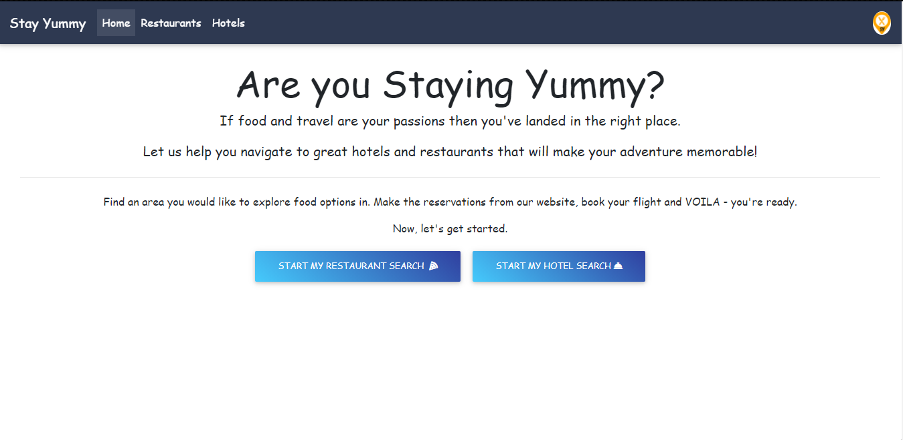
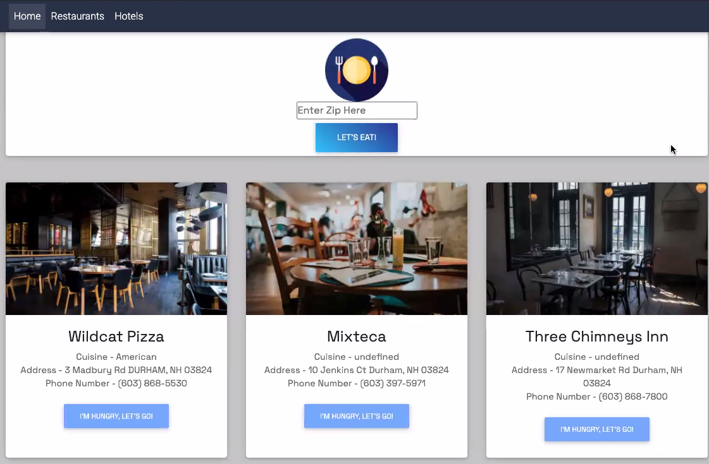
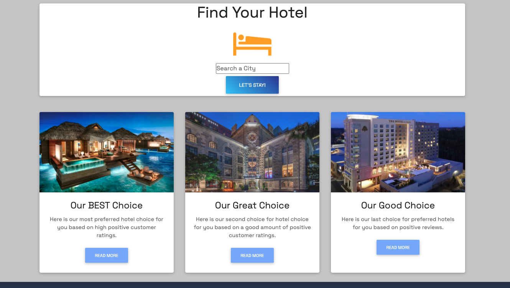
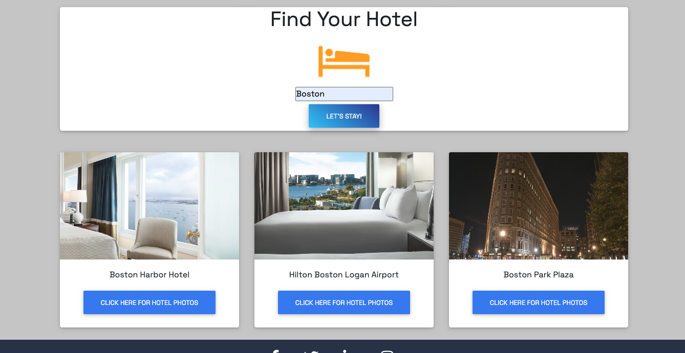
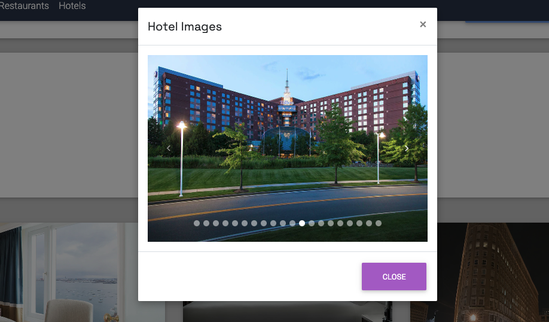
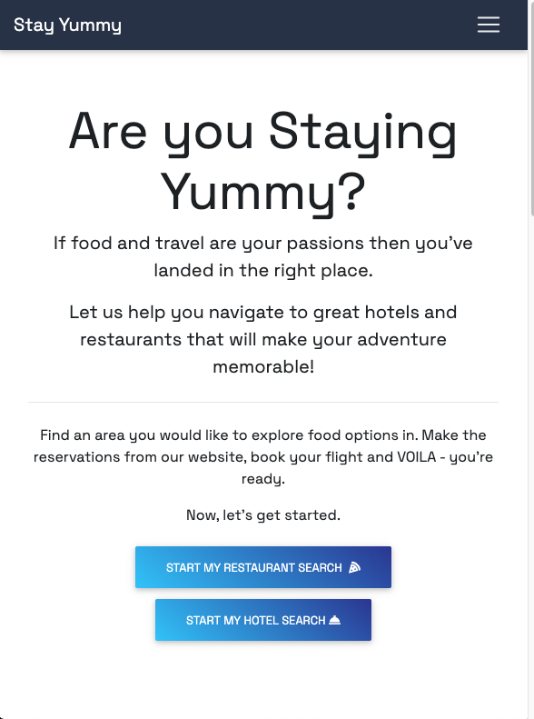
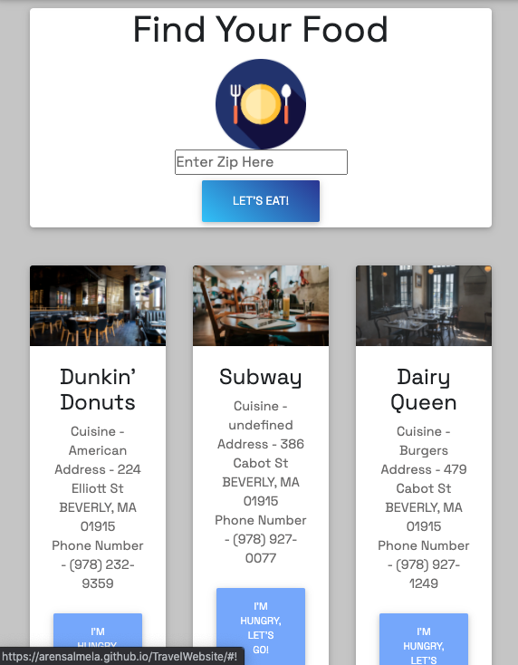

# TravelWebsite

​Deployed Website Link -> https://arensalmela.github.io/TravelWebsite/
​








## Task

Travelers want a simple to use website that can help them locate good hotels and restaurants no matter where their adventure takes them. As a developer you need to design and roll out a website to provide eat and sleep options in a streamlined interface that doesn't bog the user down with too many options so they can get out there and explore.

Your website should fulfill the following requirements:

- Use a CSS framework other than Bootstrap
- Be deployed to GitHub Pages
- Be interactive (i.e., accept and respond to user input)
- Use at least two server-side APIs
- Does not use alerts, confirms, or prompts (use modals)
- Use client-side storage to store persistent data
- Be responsive
- Have a polished UI
- Have a clean repository that meets quality coding standards (file structure, naming conventions, follows best practices for class/id naming conventions, indentation, quality comments, etc.)
- Have a quality README (with unique name, description, technologies used, screenshot, and link to deployed application)

## User Story

```
AS A traveler
I WANT to see the a few restaurant and a few hotel options for multiple cities
SO THAT I can plan a trip accordingly
```

## Acceptance Criteria

```
GIVEN a travel dashboard with form inputs
WHEN I search for a city
THEN I am presented with restaurant and / or hotel information for that city
WHEN I view option for that city
THEN I am able to easily get directions or see photos of the option
```

## Review

- Use a CSS framework other than Bootstrap
  - Used MD Bootstrap - https://mdbootstrap.com/
- Be deployed to GitHub Pages
  - Deployed link at top of this ReadMe file
- Be interactive (i.e., accept and respond to user input)
  - Several interactive features including Inputs, Buttons, Modal, Links
- Use at least two server-side APIs
  - US Restaurant Menus - https://rapidapi.com/restaurantmenus/api/us-restaurant-menus
  - Hotels API Documentation - https://rapidapi.com/apidojo/api/hotels4
- Does not use alerts, confirms, or prompts (use modals)
  - No alerts, confirms, or prompts used
- Use client-side storage to store persistent data
  - Client-side storage used for restaurant cards
- Be responsive
  - Website is responsive
- Have a polished UI
  - UI is clean, clear, and easy to use
- Have a clean repository that meets quality coding standards (file structure, naming conventions, follows best practices for class/id naming conventions, indentation, quality comments, etc.)
  - Repository best practices followed
- Have a quality README (with unique name, description, technologies used, screenshot, and link to deployed application)
  - ReadMe complete
